# Novel Splitter (小说切分与 RAG 预处理系统)

[](LICENSE)
[](https://www.oracle.com/java/technologies/javase/jdk21-archive-downloads.html)
[](https://spring.io/projects/spring-boot)
[](https://react.dev/)

这是一个专门为 AI 时代打造的**小说处理与 RAG (检索增强生成) 基础设施**。

简单来说，它的作用是：**把一本几百万字的小说，自动“拆解”成 AI (ChatGPT, DeepSeek, Gemini 等) 能够理解和处理的高质量语义片段（Scene），并提供从文本切分到向量检索的一站式 RAG 能力。**

如果你想做一个“小说角色扮演 AI”或者“小说问答机器人”，那么这个项目就是为你准备的第一步核心组件。它负责把脏乱差的 TXT 文本，清洗、切分、整理成高质量的结构化数据，并确保 AI 回答时能获取到最准确、最连贯的上下文。

## ✨ 核心特性

本项目不只是一个简单的“按字数切分”脚本，而是为中文小说深度优化的智能处理系统：

1.  **全自动下载**：内置了基于 Jsoup 的爬虫，配置好网址列表即可自动抓取几百章小说并合并为标准格式的 `novel.txt`。
2.  **智能语义切分 (Smart Splitter)**：
    *   **章节感知**：通过正则表达式和规则引擎（`ChapterRecognizer`）精准识别小说章节边界。
    *   **上下文合并**：内置 `ContextAwareSegmentBuilder`，能够将“说话人”与“说话内容”智能合并，避免对话被生硬切断。
    *   **动态窗口切分**：基于 Markdown 格式和空行的 `MarkdownParagraphSplitter`，尽量保证每个 Scene 都是一个完整的小故事或场景。
3.  **高级 RAG 组装流水线 (5-Stage Pipeline)**：
    *   不仅提供简单的向量检索，还独创了 **5 阶段上下文组装流水线**：重评分 (ReScore)、去重 (Deduplicate)、邻接场景合并 (Merge Adjacent)、Token 预算控制 (Token Budget Control)、最终构建。这能显著解决上下文碎片化和 LLM Token 超限问题。
4.  **开箱即用的多模型支持**：统一封装了多款大模型客户端，支持 **Gemini 1.5/2.0**, **DeepSeek V3/R1**, **Coze (Bot)**, **Ollama**。内置 Spring Retry 重试机制与 Token 防截断控制。
5.  **纯本地化向量引擎**：内置 ONNX Runtime 引擎（`OnnxEmbeddingService`），支持直接在本地加载 BGE 等模型进行文本向量化，无需依赖外部 API，保护数据隐私并节省成本。同时也支持外接 Chroma 向量数据库。
6.  **现代化可视化界面**：附带基于 React 19 + Vite 构建的 Web 界面，支持可视化上传、切分进度监控、知识库版本管理以及直接的 RAG 对话测试。

---

## 🏗 系统架构与核心模块现状分析

本项目采用前后端分离的多模块 (Multi-module) 架构，后端基于 Spring Boot，按照领域驱动设计（DDD）思想被拆分为 12 个逻辑模块，前端为 1 个独立的 React 模块。

### 1. 表现与接入层 (Presentation & Entry)
*   **`application` (应用入口)**
    *   **职责**：Spring Boot 核心启动入口，整合所有模块。提供基于 RESTful API 的控制器（如 `NovelController`、`ChatController`、`VectorManagementController`）。同时提供 `SplitCommandRunner` 供极客用户在命令行模式下运行。
*   **`novel-splitter-web` (现代前端 UI)**
    *   **职责**：提供全套的图形化操作界面，降低系统使用门槛。
    *   **现状**：基于 React 19, TypeScript, Zustand, TanStack Query 和 Tailwind CSS 4 构建。包含小说导入 (Ingest)、知识库管理 (Knowledge)、RAG 对话测试 (Chat) 和系统向量库监控 (System) 四大核心页面。

### 2. 核心处理引擎 (Core Processing Engine)
*   **`pipeline` (流程编排)**
    *   **职责**：负责串联小说的处理生命周期。实现为 `SequentialPipeline`，按顺序执行加载 (Load)、切分 (Split)、校验 (Validation) 和保存 (Save) 四个阶段。
*   **`splitter` (切分引擎)**
    *   **职责**：项目的核心业务。将长文本转化为带有元数据的 `Scene`（场景）。
    *   **现状**：目前已完成前三个阶段的进化。包含 `ChapterRecognizer` (章节识别)、`MarkdownParagraphSplitter` (段落级别物理拆分)、`ContextAwareSegmentBuilder` (上下文语境合并) 以及 `SceneAssembler` (最终组装与重叠度控制)。
*   **`validation` (数据质检)**
    *   **职责**：负责检查切分出的结果是否符合标准（如拦截过短的废片段）。
    *   **现状**：已实现 `LengthValidator`，为系统数据质量把关。
*   **`domain` (领域模型)**
    *   **职责**：定义整个系统通用语言（Ubiquitous Language）。
    *   **现状**：无业务逻辑，纯净的 POJO 集合，定义了 `Novel`, `Chapter`, `Scene`, `RawParagraph` 等核心实体，所有其他模块均依赖此模块。

### 3. RAG 与大模型基础设施 (RAG & LLM Infrastructure)
*   **`embedding` (向量化层)**
    *   **职责**：将纯文本“翻译”为高维稠密向量。
    *   **现状**：双引擎架构。既可以通过 `OnnxEmbeddingService` 在本地 JVM 内直接运行 `.onnx` 格式的嵌入模型，也提供 `ChromaVectorStore` 对接专业的 Chroma 向量数据库，还提供 `InMemoryVectorStore` 供快速测试。
*   **`retrieval` (检索调度)**
    *   **职责**：根据用户 Query，在海量切分片段中找出最相关的内容。
    *   **现状**：实现了 `VectorRetrievalService`，并结合 `RuleBasedPolicyClassifier`，能够根据问题的特性自动调整检索策略（如是否需要启用特定实体的加权）。
*   **`context-assembler` (上下文智能组装)**
    *   **职责**：解决大模型“金鱼记忆”和“上下文碎片化”的痛点。
    *   **现状**：实现了标准的 5 阶段流水线。它能将检索回来的离散 `Scene`，根据小说的原生章节顺序进行相邻合并，并严格根据 `AssemblerConfig` 的 Token 预算计算器剔除溢出内容，生成最完美的 Prompt 上下文。
*   **`llm-client` (统一大模型网关)**
    *   **职责**：与各种大模型 API 打交道的外交官。
    *   **现状**：提供统一的接口规范，已支持 Gemini, DeepSeek, Coze, Ollama。内部封装了 `spring-retry` 实现了失败重试机制，并通过读取 `maxOutputTokens` 配置防止模型回答被强制截断。

### 4. 基础设施与扩展 (Infrastructure & Utilities)
*   **`novelDownloader` (数据获取)**
    *   **职责**：自动化的小说爬虫。
    *   **现状**：基于 Jsoup 解析网页，能根据提供的 `urllist.txt` 批量下载并清洗 HTML 标签，合并为干净的 TXT 文本。
*   **`repository` (本地仓储)**
    *   **职责**：数据的物理落盘管理。
    *   **现状**：将切分结果存储在项目根目录的 `novel-storage` 中。支持按小说 ID 和时间戳版本（如 `novel_20231027_120000`）进行多版本隔离和存储。
*   **`infrastructure` (底层基建)**
    *   **职责**：通用工具箱。
    *   **现状**：包含 JSON 序列化工具、文件 IO 操作以及 `Dotenv` 环境变量加载器，确保 `.env` 中的敏感 API Key 能够被 Spring Boot 完美接管。

---

## 🌊 核心数据流转图 (Data Flow)

### 1. 入库切分流 (Ingestion Pipeline)
小说从 TXT 文本变为可被 AI 检索的向量知识库，经历了如下流水线：

```mermaid
graph TD
    A[原始TXT文件 / 爬虫抓取] -->|1. LoadStage| B(按行读取并清理)
    B -->|2. SplitStage| C{ChapterRecognizer}
    C -->|划分章节| D[MarkdownParagraphSplitter]
    D -->|切分段落| E[SceneAssembler]
    E -->|合并组装| F((Scene 列表))
    F -->|3. ValidationStage| G{长度/质量校验}
    G -->|过滤无效数据| H|4. SaveStage|
    H --> I[Repository: 存为JSON]
    H --> J[Embedding: 存入向量数据库]
```

### 2. 对话检索流 (RAG Chat Flow)
当用户发起提问时，系统如何构建高质量上下文：

```mermaid
graph LR
    U[用户提问 Query] --> R(RuleBasedPolicyClassifier)
    R -->|判断检索策略| V[VectorRetrievalService]
    V -->|查询向量库| DB[(Chroma / InMemory)]
    DB -->|返回 Top-K Scenes| C[Context Assembler]
    
    subgraph 5-Stage Context Pipeline
        C1(ReScore 重评分) --> C2(Deduplicate 去重)
        C2 --> C3(Merge Adjacent 相邻合并)
        C3 --> C4(Token Budget 预算控制)
        C4 --> C5(Build Prompt 组装文本)
    end
    
    C --> C1
    C5 --> LLM(LLM Client)
    LLM -->|调用 Gemini/DeepSeek...| ANS[返回最终回答]
```



---

## 🚀 快速开始与详细配置

### 1. 环境准备
- **JDK 21**：因为用到了虚拟线程和新的 Switch 模式匹配等特性，Java 21 是最低要求。
- **Maven 3.8+**：用于编译后端代码。
- **Node.js 20+ & pnpm**：用于运行和编译前端界面（可选，后端已集成编译好的静态文件则不需要）。

### 2. 编译项目
打开终端（CMD 或 PowerShell），执行以下命令：

```bash
# 1. 下载并进入项目
cd novel-splitter

# 2. 编译整个后端项目（这会下载依赖包，可能需要几分钟）
mvn clean package -DskipTests
```
看到 `BUILD SUCCESS` 即代表编译成功。

### 3. 高级环境变量配置 (.env)
为了使用真实的大模型（如 Gemini 或 DeepSeek），并调整系统行为，你需要在项目根目录下创建一个名为 `.env` 的文件（可复制 `.env.example`）。

以下是核心配置说明：

```env
# ====== LLM 客户端配置 ======
# Gemini API Key (目前免费且上下文窗口极大，推荐首选)
GEMINI_API_KEY=your_gemini_api_key
# 防止 Gemini 回答过早截断的最大 Token 数，建议设为 8192
GEMINI_MAX_OUTPUT_TOKENS=8192

# DeepSeek API Key (性价比高，中文效果好)
DEEPSEEK_API_KEY=your_deepseek_api_key

# Coze Bot 配置 (适合将知识库放在 Coze 上托管的用户)
COZE_API_KEY=your_coze_token
COZE_BOT_ID=your_bot_id

# ====== 系统路径与核心配置 ======
# 小说存储根目录，默认在项目下的 novel-storage
STORAGE_ROOT=./novel-storage
```

### 4. `application.yml` 高级配置 (按需修改)
除了 `.env`，部分系统行为定义在 `application/src/main/resources/application.yml` 中：
*   **大文件上传限制**：小说 TXT 往往很大，若上传失败，请检查或调大 YAML 中的 `spring.servlet.multipart.max-file-size` (默认 50MB) 和 `max-request-size`。
*   **Token 组装预算**：在 `assembler` 配置块中，可以修改 `maxContextTokens` 来控制发送给大模型的上下文总量。系统默认使用 `SimpleTokenCounter` (按字符数 * 1.5 估算)。
*   **小说 ID 规范 (Novel ID Normalization)**：系统底层逻辑会自动剥离上传文件的 `.txt` 后缀作为知识库的唯一 ID（如 `novel.txt` -> `novel`），在查询 RAG 和向量库时需保持一致。

### 5. 运行服务

**启动后端与 Web 界面：**
```bash
java -jar application/target/application-1.0.0-SNAPSHOT.jar
```
当看到 `Started NovelSplitApplication in ...` 字样时，打开浏览器访问：
👉 **http://localhost:8080/**

在可视化界面上，你可以完成：上传文件 -> 开始切分 -> 知识库管理 -> 在线 Chat 对话等完整流程。

**极客命令行模式：**
如果不想用 Web 界面，也可以直接用命令触发切分任务：
```bash
java -jar application/target/application-1.0.0-SNAPSHOT.jar --file="D:\books\斗破苍穹.txt" --version="v1"
```

---

## ❓ 常见问题与 RAG 原理说明 (FAQ)

**Q: 什么是 RAG？为什么我不直接把整本小说发给大模型？**
A: RAG (Retrieval-Augmented Generation，检索增强生成) 是目前让 AI 读懂超大私有数据的主流技术。虽然现在有些大模型支持 100万甚至 200万 Token 的上下文，但直接丢整本小说不仅**极度昂贵**，还会导致模型**注意力失焦（Lost in the middle）**，导致回答幻觉。本项目通过“先切分、再检索、后组装”的 RAG 机制，以极低的成本提供最准确的小说细节问答。

**Q: 为什么不直接用 LangChain 或 LlamaIndex？**
A: 通用的 RAG 框架处理英文说明文档很强，但处理**中文小说**简直是灾难。本项目是专门为中文小说定制的，我们解决了以下痛点：
1.  通用工具会生硬地把一句话切成两半，本项目能识别“章节”并合并“人物对话”。
2.  通用工具只返回离散的片段，本项目的 `Context Assembler` 能把相邻的切分片段像拼图一样重新拼起来，给 LLM 提供流畅的上下文。

**Q: 切分后的数据存在哪里？**
A: 切分好的 JSON 文件默认存在项目目录下的 `novel-storage` 文件夹里，向量数据存储在 Chroma 容器或内存中。系统还提供了完整的 `VectorManagementController` 用于手动清除和管理这些知识库。

## 🤝 贡献与反馈
如果你在阅读某本特定风格的小说时发现切分效果不好，或者对“Smart Splitter Evolution Design”的第四阶段（提取 SplitQualityEvaluator）有兴趣，非常欢迎提交 Issue 或者 Pull Request！

---
*Happy Coding! 愿你的 AI 更懂小说。*
