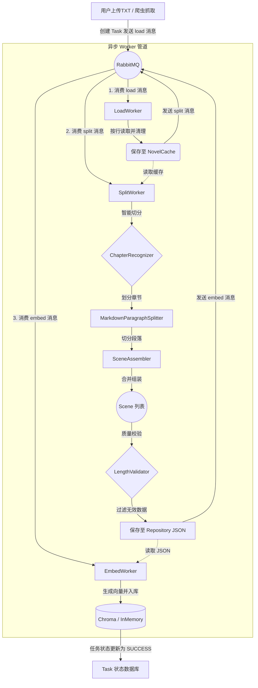

# Novel Splitter (小说切分与 RAG 预处理系统)

[](LICENSE)
[](https://www.oracle.com/java/technologies/javase/jdk21-archive-downloads.html)
[](https://spring.io/projects/spring-boot)
[](https://react.dev/)

这是一个专门为 AI 时代打造的**小说处理与 RAG (检索增强生成) 基础设施**。

简单来说，它的作用是：**把一本几百万字的小说，自动“拆解”成 AI (ChatGPT, DeepSeek, Gemini 等) 能够理解和处理的高质量语义片段（Scene），并提供从文本切分到向量检索的一站式 RAG 能力。**

如果你想做一个“小说角色扮演 AI”或者“小说问答机器人”，那么这个项目就是为你准备的第一步核心组件。它负责把脏乱差的 TXT 文本，清洗、切分、整理成高质量的结构化数据，并确保 AI 回答时能获取到最准确、最连贯的上下文。

## ✨ 核心特性

本项目不只是一个简单的“按字数切分”脚本，而是为中文小说深度优化的智能处理系统：

1.  **全自动下载**：内置了基于 Jsoup 的爬虫，配置好网址列表即可自动抓取几百章小说并合并为标准格式的 `novel.txt`。
2.  **智能语义切分 (Smart Splitter)**：
    *   **章节感知**：通过正则表达式和规则引擎（`ChapterRecognizer`）精准识别小说章节边界。
    *   **上下文合并**：内置 `ContextAwareSegmentBuilder`，能够将“说话人”与“说话内容”智能合并，避免对话被生硬切断。
    *   **动态窗口切分**：基于 Markdown 格式和空行的 `MarkdownParagraphSplitter`，尽量保证每个 Scene 都是一个完整的小故事或场景。
3.  **高级 RAG 组装流水线 (5-Stage Pipeline)**：
    *   不仅提供简单的向量检索，还独创了 **5 阶段上下文组装流水线**：重评分 (ReScore)、去重 (Deduplicate)、邻接场景合并 (Merge Adjacent)、Token 预算控制 (Token Budget Control)、最终构建。这能显著解决上下文碎片化和 LLM Token 超限问题。
4.  **开箱即用的多模型支持**：统一封装了多款大模型客户端，支持 **Gemini 1.5/2.0**, **DeepSeek V3/R1**, **Coze (Bot)**, **Ollama**。内置 Spring Retry 重试机制与 Token 防截断控制。
5.  **纯本地化向量引擎**：内置 ONNX Runtime 引擎（`OnnxEmbeddingService`），支持直接在本地加载 BGE 等模型进行文本向量化，无需依赖外部 API，保护数据隐私并节省成本。同时也支持外接 Chroma 向量数据库。
6.  **现代化可视化界面**：附带基于 React 19 + Vite 构建的 Web 界面，支持可视化上传、切分进度监控、知识库版本管理以及直接的 RAG 对话测试。

---

## 🔧 最近稳定性修复（2026-04）

针对大文本导入与章节预览场景，已完成以下工程级修复：

1. **章节场景查询强制分页，避免大章节 OOM**
   - `GET /api/novels/{novelId}/chapters/{chapterId}/scenes` 增加 `page`、`size` 参数。
   - 后端 DAO 从全量 `List` 查询改为 `Pageable` 分页查询，并在服务层增加安全边界（`page >= 0`，`size` 最大 500）。
   - 前端预览接口改为按页请求并读取分页 `content`，避免一次性拉取全部 Scene。

2. **上传流程重构：文件 IO 与数据库事务解耦**
   - 原 `createNovel` 存在“事务内执行磁盘 IO”的风险，已改为“先写文件，再用显式事务落库”。
   - 数据库写入失败时，执行文件补偿删除，避免文件与数据库状态不一致。

3. **批量写入性能优化配置补齐**
   - 已在 `application.yml` 增加：
     - `spring.jpa.properties.hibernate.jdbc.batch_size: 500`
     - `spring.jpa.properties.hibernate.order_inserts: true`
   - 配合分批 `saveAll`，显著提升大规模 Scene 入库性能。

4. **前端 API Envelope 校验增强**
   - `isApiEnvelope` 增加数组拦截与 `code` 有限数值校验，减少协议异常被误判为合法响应的风险。

---

## 📋 工程级分析报告（代码审计版）

> 本报告基于当前仓库代码结构、依赖与配置进行推断；无法从代码直接证明的点，统一标记为“缺失信息”。

### 1) 项目整体架构分析

- **架构模式**：前后端分离 + 后端多模块单体（非微服务）。
  - 依据：根 `pom.xml` 为聚合工程（`domain/infrastructure/application/interfaces/...`），前端独立 `novel-splitter-web`。
- **分层设计**：`Controller -> Facade/Service -> DomainRepository -> JpaRepository` 主链路清晰。
  - 依据：`interfaces/api/NovelController`、`application/service/novel/NovelFacadeServiceImpl`、`domain/repository/SceneRepository`、`infrastructure/persistence/repository/*`。
- **模块边界**：DDD 端口-适配器思路成立（`domain` 定义仓储接口，`infrastructure` 提供实现）。
  - 依据：`domain/repository/*.java` 与 `infrastructure/.../repository/impl/*.java`。
- **伪分层/上帝类风险**：`NovelFacadeServiceImpl` 聚合上传、切分、嵌入、下载、统计、章节场景查询，已出现编排膨胀趋势。
  - 依据：`application/service/novel/NovelFacadeServiceImpl` 方法密度与职责跨度。

### 2) Spring Boot 后端分析

- **技术栈识别**
  - Spring Boot `3.2.1`，Java `21`（依据：根 `pom.xml`）。
  - ORM：Spring Data JPA + PostgreSQL（依据：`infrastructure/pom.xml`、`interfaces/pom.xml`）。
  - 中间件：RabbitMQ（依据：`application/pom.xml` `spring-boot-starter-amqp`）。
  - 缓存：存在 `TaskCachePort` 抽象，但默认实现是 `NoOpTaskCache`（依据：`application/port/out/NoOpTaskCache.java`）。
- **依赖合理性**
  - 正向：启用 `maven-enforcer-plugin` 约束依赖收敛（依据：根 `pom.xml`）。
  - 风险：未引入 Spring Security，鉴权依赖手写拦截器（依据：`interfaces/pom.xml` + `AuthInterceptor`）。
- **配置结构**
  - `application.yml` 分层清晰（datasource/rabbitmq/llm/embedding/splitter）。
  - 已补齐 JPA 批处理关键项：`hibernate.jdbc.batch_size=500`、`order_inserts=true`。
- **事务与异常治理**
  - 全局异常与统一返回封装完善（依据：`GlobalExceptionHandler`、`GlobalResponseAdvice`、`ApiResponse`）。
  - `createNovel` 已重构为“IO 与 DB 事务解耦 + 失败补偿删除”。
- **反模式检查**
  - Controller 过重：当前不明显，多为薄控制器。
  - Service 膨胀：`NovelFacadeServiceImpl` 明显。
  - Mapper 业务逻辑：未见主要业务下沉 Mapper，基本是对象映射。

### 3) React 前端分析

- **技术栈**：React `19` + Vite `7` + TanStack Query + Axios + Zustand + Tailwind。
  - 依据：`novel-splitter-web/package.json`。
- **状态管理**
  - 服务端状态主要由 React Query 管理，方向正确。
  - Zustand `useAppStore` 当前近乎空壳，需明确边界（跨页 UI 状态 or 业务状态）。
- **路由设计**
  - `createBrowserRouter` 平铺路由，未见前端路由级权限守卫。
  - 依据：`novel-splitter-web/src/router/index.tsx`。
- **API 封装**
  - `apiClient` 有请求/响应拦截、统一 envelope 解包、异常提示，工程性较好。
  - `isApiEnvelope` 已增强校验（数组拦截 + 有限数值校验）。
- **组件拆分**
  - 页面+hooks 结构清晰；但 `useIngestTask` 责任较多（UI 状态、多个 mutation、流程控制）。

### 4) 前后端交互设计

- **API 风格**：大体 RESTful，但存在版本路径并存（`/api/novels/*` 与 `/api/v1/download/*`）。
- **DTO/VO 规范**：后端 DTO 与前端 TS 接口配套较完整。
- **错误码体系**：统一为 `{code,message,data}`，但业务码体系粒度仍偏粗（多数沿用 HTTP 语义）。
- **鉴权方式**：静态 Bearer Token（非 JWT/Session/OAuth）。
  - 依据：`AuthInterceptor` + 前端 `api/client.ts`。

### 5) 数据流与关键链路分析（重点）

- **链路示例（上传并切分）**
  - 页面：`Ingest` -> `novelApi.uploadNovel` / `novelApi.splitNovel`
  - API：`POST /api/novels/upload`、`POST /api/novels/{novelId}/split`
  - Controller：`NovelController`
  - Service：`NovelFacadeServiceImpl` -> `NovelServiceImpl` / `TaskService`
  - DAO：`NovelRepositoryJpaImpl` / `SplitTaskRepositoryJpaImpl`
  - DB：`JpaNovelRepository` / `JpaSplitTaskRepository`
- **耦合点**
  - `NovelFacadeServiceImpl` 对 MQ、下载、任务、章节场景查询多点耦合。
  - 前后端强依赖统一 envelope 协议。
- **潜在瓶颈**
  - 任务轮询读压（默认 NoOp cache）。
  - 下载入口同步阻塞。
  - 聚合统计中存在 `findAll()` 风险路径。
- **优化点**
  - 引入真实缓存（Redis/Caffeine）。
  - 下载流程任务化。
  - 统计类接口分页/聚合下推数据库。

### 6) 性能与扩展性分析

- **高并发能力**：中等。异步 MQ 链路是优势，但轮询与统计仍偏 DB 压力型。
- **典型瓶颈核查**
  - N+1：存在 LAZY 关联风险信号；场景查询已通过分页与 `EntityGraph` 降低风险。
  - 大事务：`createNovel` 已修复为 IO 与事务分离。
  - 阻塞调用：下载接口仍是同步下载后再提交异步入库，需继续异步化。
- **水平扩展**：具备基础条件（无 Session 粘性依赖），但鉴权/缓存/限流治理仍不足。

### 7) 安全性分析

- **SQL 注入**：主要依赖 JPA Repository，未见手写拼接 SQL 风险点。
- **XSS**：前端 token 使用 `localStorage`，若发生 XSS 会放大令牌泄露风险。
- **CSRF**：非 Cookie Session 模型下风险相对低，但缺少完整安全框架护栏。
- **鉴权绕过风险**：静态 token 模型无过期、无角色、无审计粒度。
- **敏感信息泄露**
  - 配置支持环境变量注入是正向。
  - `DEBUG` 日志与错误打印需持续审查，避免落敏感字段。

### 8) 工程质量评估

- **代码规范**：命名与层次整体规范，接口语义明确。
- **可维护性**：模块化良好，但编排类职责集中需要持续拆分。
- **可测试性**：分层结构利于单测；跨模块流程更依赖集成测试。
- **CI/CD 友好性**：多模块 Maven + Enforcer 较友好；需避免构建产物进入版本库。

### 9) 问题清单（按严重程度）

- [严重] 鉴权模型过弱（静态全局 Token）
  - 影响：Token 泄漏可导致全接口失守，无法做细粒度授权审计。
  - 原因：`AuthInterceptor` 等值比对，未接入标准安全体系。
  - 修改建议：引入 Spring Security + JWT/OAuth2，补充角色与过期机制。

- [严重] 任务轮询热点缺少有效缓存实现
  - 影响：并发轮询时数据库读压上升。
  - 原因：`TaskCachePort` 默认 `NoOpTaskCache`。
  - 修改建议：接入 Redis/Caffeine，并对轮询接口做限频与降级。

- [高] 同步下载入口存在阻塞风险
  - 影响：慢链路占用请求线程，降低吞吐。
  - 原因：`DownloadController` 直接同步下载。
  - 修改建议：下载改为异步任务，统一走任务队列与状态机。

- [高] 跨域策略放开风险（部分接口 `@CrossOrigin("*")`）
  - 影响：攻击面扩大，叠加 token 模式风险更高。
  - 原因：控制器级通配跨域。
  - 修改建议：统一在网关或全局配置做白名单化管理。

- [中] API 版本风格不统一
  - 影响：长期接口治理与文档维护复杂。
  - 原因：`/api/*` 与 `/api/v1/*` 混用。
  - 修改建议：统一版本策略并提供迁移窗口。

### 10) 优化路线图（可执行）

- **阶段1（1~3天）**
  - 收敛跨域策略为白名单。
  - 强制生产环境关闭 `ddl-auto=update`。
  - 给轮询接口加限频和阈值保护。
  - 审计并脱敏关键日志字段。

- **阶段2（1~2周）**
  - 接入 Spring Security（JWT 过期/刷新/角色）。
  - 落地 Redis/Caffeine 任务缓存与命中率监控。
  - 下载链路异步化改造。
  - 将 `NovelFacadeServiceImpl` 拆分为多个 Orchestrator。

- **阶段3（架构升级）**
  - 轮询升级为 SSE/WebSocket 推送。
  - 引入 Flyway/Liquibase + 索引治理 + 慢查询闭环。
  - 建立统一网关鉴权、限流、审计策略。

### 缺失信息（无法从代码直接判定）

- 未见完整生产网关/WAF 配置，无法确认外围安全兜底策略。
- 缺少数据库执行计划与慢查询统计，无法量化 N+1 与索引命中问题规模。
- 缺少完整 CI 流水线定义文件，无法评价制品发布与质量门禁细节。

---

## 🏗 系统架构与核心模块现状分析

本项目采用前后端分离的多模块 (Multi-module) 架构，后端基于 Spring Boot，按照领域驱动设计（DDD）思想被拆分为 12 个逻辑模块，前端为 1 个独立的 React 模块。

### 1. 表现与接入层 (Presentation & Entry)
*   **`application` (应用入口)**
    *   **职责**：Spring Boot 核心启动入口，整合所有模块。提供基于 RESTful API 的控制器（如 `NovelController`、`ChatController`、`VectorManagementController`）。整合 RabbitMQ 实现了基于消息队列的异步任务调度，包含 `LoadWorker`、`SplitWorker` 和 `EmbedWorker` 三阶段异步流水线，彻底解决大文件处理时的阻塞和内存溢出问题。
*   **`novel-splitter-web` (现代前端 UI)**
    *   **职责**：提供全套的图形化操作界面，降低系统使用门槛。
    *   **现状**：基于 React 19, TypeScript, Zustand, TanStack Query 和 Tailwind CSS 4 构建。包含小说导入 (Ingest)、知识库管理 (Knowledge)、RAG 对话测试 (Chat) 和系统向量库监控 (System) 四大核心页面。

### 2. 核心处理引擎 (Core Processing Engine)
*   **`pipeline` (流程编排)**
    *   **职责**：负责串联小说的处理生命周期。实现为 `SequentialPipeline`，按顺序执行加载 (Load)、切分 (Split)、校验 (Validation) 和保存 (Save) 四个阶段。
*   **`splitter` (切分引擎)**
    *   **职责**：项目的核心业务。将长文本转化为带有元数据的 `Scene`（场景）。
    *   **现状**：目前已完成前三个阶段的进化。包含 `ChapterRecognizer` (章节识别)、`MarkdownParagraphSplitter` (段落级别物理拆分)、`ContextAwareSegmentBuilder` (上下文语境合并) 以及 `SceneAssembler` (最终组装与重叠度控制)。
*   **`validation` (数据质检)**
    *   **职责**：负责检查切分出的结果是否符合标准（如拦截过短的废片段）。
    *   **现状**：已实现 `LengthValidator`，为系统数据质量把关。
*   **`domain` (领域模型)**
    *   **职责**：定义整个系统通用语言（Ubiquitous Language）。
    *   **现状**：无业务逻辑，纯净的 POJO 集合，定义了 `Novel`, `Chapter`, `Scene`, `RawParagraph` 等核心实体，所有其他模块均依赖此模块。

### 3. RAG 与大模型基础设施 (RAG & LLM Infrastructure)
*   **`embedding` (向量化层)**
    *   **职责**：将纯文本“翻译”为高维稠密向量。
    *   **现状**：双引擎架构。既可以通过 `OnnxEmbeddingService` 在本地 JVM 内直接运行 `.onnx` 格式的嵌入模型，也提供 `ChromaVectorStore` 对接专业的 Chroma 向量数据库，还提供 `InMemoryVectorStore` 供快速测试。
*   **`retrieval` (检索调度)**
    *   **职责**：根据用户 Query，在海量切分片段中找出最相关的内容。
    *   **现状**：实现了 `VectorRetrievalService`，并结合 `RuleBasedPolicyClassifier`，能够根据问题的特性自动调整检索策略（如是否需要启用特定实体的加权）。
*   **`context-assembler` (上下文智能组装)**
    *   **职责**：解决大模型“金鱼记忆”和“上下文碎片化”的痛点。
    *   **现状**：实现了标准的 5 阶段流水线。它能将检索回来的离散 `Scene`，根据小说的原生章节顺序进行相邻合并，并严格根据 `AssemblerConfig` 的 Token 预算计算器剔除溢出内容，生成最完美的 Prompt 上下文。
*   **`llm-client` (统一大模型网关)**
    *   **职责**：与各种大模型 API 打交道的外交官。
    *   **现状**：提供统一的接口规范，已支持 Gemini, DeepSeek, Coze, Ollama。内部封装了 `spring-retry` 实现了失败重试机制，并通过读取 `maxOutputTokens` 配置防止模型回答被强制截断。

### 4. 基础设施与扩展 (Infrastructure & Utilities)
*   **`novelDownloader` (数据获取)**
    *   **职责**：自动化的小说爬虫。
    *   **现状**：基于 Jsoup 解析网页，能根据提供的 `urllist.txt` 批量下载并清洗 HTML 标签，合并为干净的 TXT 文本。
*   **`repository` (本地仓储)**
    *   **职责**：数据的物理落盘管理。
    *   **现状**：将切分结果存储在项目根目录的 `novel-storage` 中。支持按小说 ID 和时间戳版本（如 `novel_20231027_120000`）进行多版本隔离和存储。
*   **`infrastructure` (底层基建)**
    *   **职责**：通用工具箱。
    *   **现状**：包含 JSON 序列化工具、文件 IO 操作以及 `Dotenv` 环境变量加载器，确保 `.env` 中的敏感 API Key 能够被 Spring Boot 完美接管。

---

## 🌊 核心数据流转图 (Data Flow)

### 1. 入库切分流 (Ingestion Pipeline)
小说从 TXT 文本变为可被 AI 检索的向量知识库，经历了如下流水线：



### 2. 对话检索流 (RAG Chat Flow)
当用户发起提问时，系统如何构建高质量上下文：


---

## 🚀 快速开始与全栈 Docker 部署 (Deployment)

本项目支持跨平台的 Docker 一键全栈部署，包括前端、后端、数据库和中间件。

### 1. 环境准备
- **Docker & Docker Compose**：必须安装。
- **Java 21 & Maven 3.8+**：用于本地编译后端。
- **Node.js 22+**：用于本地编译前端（可选，脚本中会通过容器编译）。

### 2. 简单修改配置 (必读)
本项目统一使用 `config/` 目录下的环境文件作为配置来源：

- `config/.env.dev`：开发环境
- `config/.env.prod`：生产环境
- `config/.env.example`：模板文件

首次使用时，请先复制模板并填写必要的大模型 API Key、路径和端口。

```bash
cp config/.env.example config/.env.dev
```

如需生产环境配置，可再复制一份：

```bash
cp config/.env.example config/.env.prod
```

**关键配置项说明：**
- `NOVEL_LLM_PROVIDER`：选择你想用的大模型供应商（可选：`deepseek`, `gemini`, `ollama`, `coze`）。
- `*_API_KEY`：填入对应大模型的 API Key。
- `APP_DATA_PATH` 和 `DOCKER_DATA_PATH`：请尽量使用正斜杠路径，例如 `D:/soft/novel-splitter`、`D:/docker_data`。
- `DB_HOST`、`RABBITMQ_HOST`、`CHROMA_URL`：在本地直跑 Spring Boot 时保持 `localhost`；使用 Docker 部署时，Compose 会自动改写为容器内部服务地址，无需手动切换。
- 根目录 `.env` 不再作为运行时主入口，本地与 Docker 都以 `config/.env.dev` / `config/.env.prod` 为准。

### 3. 一键编译与打包镜像
我们提供了跨平台的编译脚本。在根目录下执行：

**Windows (CMD/PowerShell):**
```cmd
.\scripts\build.bat
# 或
.\scripts\build.ps1
```

**Linux / macOS:**
```bash
./scripts/build.sh
```

### 4. 启动服务
Compose 文件职责已经拆分：

- `docker-compose.yml`：基础共享定义
- `docker-compose.dev.yml`：开发环境端口与挂载
- `docker-compose.prod.yml`：生产环境端口、挂载、重启策略与资源限制

你可以选择启动开发环境或生产环境。生产环境会自动应用资源限制和自动重启策略。

**Windows:**
```cmd
# 启动开发环境
.\scripts\deploy.bat dev latest

# 启动生产环境
.\scripts\deploy.bat prod latest
```

**Linux / macOS:**
```bash
./scripts/deploy.sh prod latest
```

当所有容器启动完成后，访问：
👉 **http://localhost:80** (前端界面)
👉 **http://localhost:8080/swagger-ui/index.html** (后端 API 文档)
👉 **http://localhost:15672** (RabbitMQ 管理面板，默认账号密码见配置)
👉 **http://localhost:8081** (Adminer 数据库管理界面)

### 5. 停止服务
执行对应的 stop 脚本即可优雅关闭并移除容器：

**Windows:**
```cmd
.\scripts\stop.bat prod
```

**Linux / macOS:**
```bash
./scripts/stop.sh prod
```

---

## 🛠 本地开发与高级配置

本地直跑 Spring Boot 时，应用会按 `SPRING_PROFILES_ACTIVE` 自动读取 `config/.env.dev` 或 `config/.env.prod`：

- 未设置时默认读取 `config/.env.dev`
- 设置 `SPRING_PROFILES_ACTIVE=prod` 时读取 `config/.env.prod`

前端浏览器侧统一访问相对路径 `/api`：

- 本地前端开发由 Vite 代理到 `VITE_API_PROXY_TARGET`
- Docker 部署由 Nginx 反向代理到后端容器

**如果你希望在本地进行高级开发，或想了解日常 DevOps 运维流程（如：如何执行全量更新、如何单独更新前端/后端某个镜像、如何打 Tag 发布指定的版本号、如何清理 Docker 缓存等），请务必参阅 [使用指南 (USAGE.md)](USAGE.md) 中的常见运维与 FAQ 章节。**

---

## ❓ 常见问题与 RAG 原理说明 (FAQ)
A: RAG (Retrieval-Augmented Generation，检索增强生成) 是目前让 AI 读懂超大私有数据的主流技术。虽然现在有些大模型支持 100万甚至 200万 Token 的上下文，但直接丢整本小说不仅**极度昂贵**，还会导致模型**注意力失焦（Lost in the middle）**，导致回答幻觉。本项目通过“先切分、再检索、后组装”的 RAG 机制，以极低的成本提供最准确的小说细节问答。

**Q: 为什么不直接用 LangChain 或 LlamaIndex？**
A: 通用的 RAG 框架处理英文说明文档很强，但处理**中文小说**简直是灾难。本项目是专门为中文小说定制的，我们解决了以下痛点：
1.  通用工具会生硬地把一句话切成两半，本项目能识别“章节”并合并“人物对话”。
2.  通用工具只返回离散的片段，本项目的 `Context Assembler` 能把相邻的切分片段像拼图一样重新拼起来，给 LLM 提供流畅的上下文。

**Q: 切分后的数据存在哪里？**
A: 切分好的 JSON 文件默认存在项目目录下的 `novel-storage` 文件夹里，向量数据存储在 Chroma 容器或内存中。系统还提供了完整的 `VectorManagementController` 用于手动清除和管理这些知识库。

## 🤝 贡献与反馈
如果你在阅读某本特定风格的小说时发现切分效果不好，或者对“Smart Splitter Evolution Design”的第四阶段（提取 SplitQualityEvaluator）有兴趣，非常欢迎提交 Issue 或者 Pull Request！

---
*Happy Coding! 愿你的 AI 更懂小说。*
