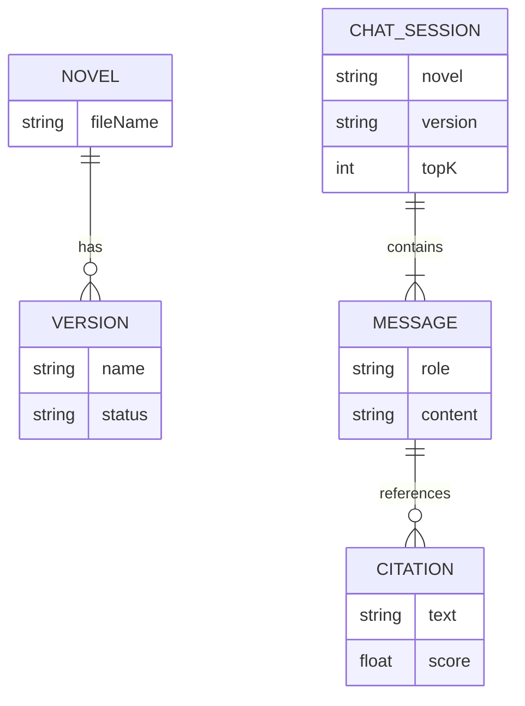

# 领域模型设计文档

## 1. 引言
本文档描述 Novel Splitter 前端应用的核心领域模型及其关系。

## 2. 核心实体 (Entities)

### 2.1 Novel (小说)
代表一本小说文件。
- **Attributes**:
  - `fileName` (string): 文件名 (唯一标识)，例如 "jydz.txt"。
  - `versions` (List<Version>): 该小说已生成的知识库版本列表。
  - `ingestConfig` (IngestConfig): 关联的入库配置（前端状态）。

### 2.2 Version (版本)
小说入库的一个特定版本。
- **Attributes**:
  - `name` (string): 版本标签，例如 "v1", "test-2024"。
  - `status` (string): 状态 (READY, PROCESSING)。

### 2.3 Scene (场景)
小说中的一个切分单元。
- **Attributes**:
  - `id` (string): 唯一标识。
  - `content` (string): 场景文本内容。
  - `metadata` (Map): 元数据 (章节、位置等)。

### 2.4 ChatSession (会话)
用户与系统的对话上下文。
- **Attributes**:
  - `novel` (string): 当前会话针对的小说。
  - `version` (string): 当前会话针对的版本。
  - `topK` (number): 检索引用数。
  - `messages` (List<Message>): 消息列表。

### 2.5 Message (消息)
对话中的单条消息。
- **Attributes**:
  - `role` (enum): USER, ASSISTANT, ERROR。
  - `content` (string): 消息内容。
  - `citations` (List<Citation>): (仅 Assistant) 参考来源。
  - `timestamp` (number): 发送时间。

### 2.6 Citation (引用)
回答所引用的原文片段。
- **Attributes**:
  - `sourceId` (string): 来源文档/场景 ID。
  - `text` (string): 引文内容。
  - `score` (number): 相关性分数。

### 2.7 SystemStats (系统状态)
向量数据库的运行状态。
- **Attributes**:
  - `storeType` (string): 数据库类型 (如 Chroma)。
  - `count` (number): 文档总数。

## 3. 实体关系图 (ER Diagram - Conceptual)

## 4. 状态管理模型 (Zustand Stores)

### 4.1 GlobalStore
- `currentTab`: 当前激活的标签页 (chat, knowledge, ingest, system)。

### 4.2 ChatStore
- `sessions`: 会话历史记录。
- `activeSessionId`: 当前会话 ID。
- `config`: 全局聊天配置 (默认 TopK 等)。

### 4.3 NovelStore
- `novels`: 小说列表缓存。
- `ingestStatus`: 入库任务状态跟踪。
