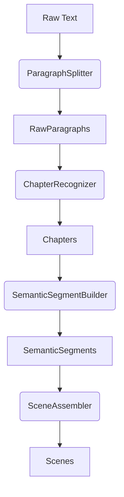

# Splitter 层详细设计

## 1. 概述
Splitter 层是系统的核心业务引擎，负责将原始文本转换为结构化的 Scene 对象。它采用**确定性规则**（Deterministic Rules）而非概率模型，确保输出的稳定性和可解释性。

## 2. 设计原则
- **纯粹性**：输入 Text -> 输出 List<Scene>，无副作用。
- **确定性**：给定相同的输入和配置，必须产生完全相同的输出。
- **可配置性**：切分规则（如字数阈值、正则模式）应可配置。

## 3. 核心流程



## 4. 详细组件

### 4.1 ParagraphSplitter (物理切分)
- **职责**：将大文本按换行符切分为 `RawParagraph` 列表。
- **逻辑**：
  - 识别 `\n`, `\r\n`。
  - 去除行首尾空白。
  - 过滤掉纯空行（或保留标记）。
  - 分配全局行号。

### 4.2 ChapterRecognizer (章节识别)
- **职责**：识别章节标题，将段落归组。
- **规则**：
  - 正则匹配：`^第[0-9一二三四五六七八九十百千]+[章回节].*`
  - 长度限制：标题通常不超过 50 字。
- **输出**：`List<Chapter>`，每个 Chapter 包含段落索引范围。

### 4.3 SemanticSegmentBuilder (语义段构建)
- **职责**：基于规则合并微小的段落，形成初步的语义块。
- **规则策略**：
  - **DialogueMerge**：连续的对话引用合并。
  - **DensityRule**：密集短句合并。
- **接口**：`List<SemanticSegment> build(List<RawParagraph> paragraphs)`

### 4.4 SceneAssembler (场景组装)
- **职责**：将 SemanticSegments 聚合成符合长度要求的 Scene。
- **核心逻辑**：
  - **软限制**：目标长度（如 800 字）。
  - **硬限制**：最小/最大长度（如 500-2000 字）。
  - **边界探测**：优先在章节边界、明显的场景分割符（如 `***`、`------`）或长时间跨度处切分。
- **规则引擎 (`rule` 包)**：
  - `TimeShiftRule`：检测时间词变化（"第二天"、"三年后"）。
  - `LocationShiftRule`：检测地点变化（"来到..."）。
  - `POVShiftRule`：视角切换。

## 5. 模块结构
```
splitter
├── api
│   └── Splitter.java (接口)
├── impl
│   ├── SimpleSplitter.java
│   └── RuleBasedSplitter.java
├── core
│   ├── ParagraphSplitter.java
│   ├── ChapterRecognizer.java
│   ├── SemanticSegmentBuilder.java
│   └── SceneAssembler.java
└── rule
    ├── SplitRule.java (接口)
    ├── LengthRule.java
    ├── RegexBoundaryRule.java
    └── KeywordRule.java
```

## 6. 待办事项
- [ ] 收集并测试常见的章节标题正则。
- [ ] 定义“场景分割符”的默认列表。
- [ ] 实现基础的滑动窗口算法用于 SceneAssembler。
