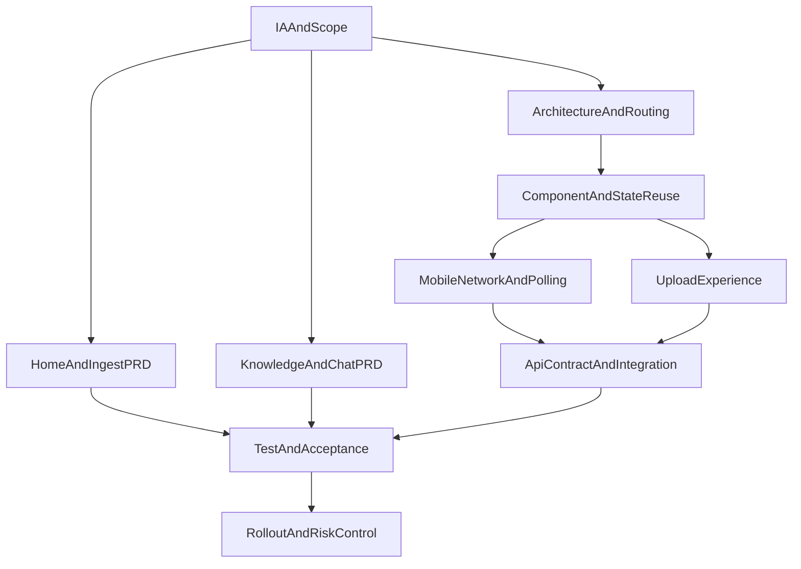

# 手机端执行文档包索引

## 1. 目标
- 为 `novel-splitter-web` 建立可执行的手机端落地文档体系。
- 覆盖从信息架构、工程实现、页面 PRD 到联调、测试、发布全流程。
- 保证每份文档都可直接拆分为开发任务与验收项。

## 2. 阅读路径
1. [`01-mobile-ia-and-scope.md`](./01-mobile-ia-and-scope.md)
2. [`02-architecture-and-routing.md`](./02-architecture-and-routing.md)
3. [`03-component-and-state-reuse.md`](./03-component-and-state-reuse.md)
4. [`04-mobile-network-and-polling.md`](./04-mobile-network-and-polling.md)
5. [`05-upload-experience-and-constraints.md`](./05-upload-experience-and-constraints.md)
6. [`06-page-prd-home-ingest.md`](./06-page-prd-home-ingest.md)
7. [`07-page-prd-knowledge-chat.md`](./07-page-prd-knowledge-chat.md)
8. [`08-api-contract-and-integration.md`](./08-api-contract-and-integration.md)
9. [`09-test-observability-and-acceptance.md`](./09-test-observability-and-acceptance.md)
10. [`10-rollout-and-risk-control.md`](./10-rollout-and-risk-control.md)

## 3. 文档依赖图

## 4. 统一术语
- **Mobile**：`/m` 路由下的手机端页面集合。
- **Desktop**：当前 `/` 路由下的 PC 页面集合。
- **任务中心**：移动首页，聚合任务进度、历史结果与失败重试。
- **一键处理**：上传成功后自动串联“触发切分（可选再触发向量化）”的前端编排。
- **任务终态**：`SUCCESS` 或 `FAILED`。

## 5. 统一状态词典
- 任务状态：`PENDING`、`PROCESSING`、`SUCCESS`、`FAILED`。
- 小说状态：`PENDING`、`SPLITTING`、`SPLIT_COMPLETED`、`EMBEDDING`、`COMPLETED`、`FAILED`。

## 6. 统一文档模板（冻结）
每份执行文档都采用下列固定章节：
1. 背景与目标  
2. 范围（In / Out）  
3. 设计决策与替代方案  
4. 详细执行方案  
5. 异常与回退策略  
6. 任务拆解与责任角色  
7. 验收标准（DoD）  
8. 风险与待确认项

## 7. 角色职责矩阵（RACI）
- **产品/业务**：范围冻结、交互优先级、验收口径。
- **前端**：路由、页面、组件、状态管理与弱网体验实现。
- **后端**：接口契约稳定性、任务状态与错误信息可观测性保障。
- **测试**：功能、兼容、弱网、回归与上线门禁执行。
- **运维**：灰度、监控、回滚策略执行。

## 8. 版本记录
- v1.0：首版手机端执行文档包，覆盖 00~10 全链路。
