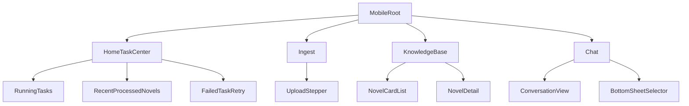

# 手机端信息架构与范围定义

## 1. 背景与目标
当前项目 PC 端导航项较多，移动端直接等比例继承会造成操作复杂、学习成本高、关键链路不聚焦。  
本方案将手机端收敛为 4 个一级入口，围绕“快速消费 + 碎片化管理”设计。

## 2. 范围
### In Scope（MVP）
- 一级导航：任务中心、入库、知识库、问答。
- 支持上传并触发处理、任务进度查看、失败重试、基础知识库浏览、移动端问答。
- `/m` 独立路由与移动端专属布局。

### Out Scope（MVP 外）
- 系统配置深度能力（模型参数、管理后台全部能力）。
- Chroma 管理和 Debug 工具的完整移动化。
- 手机端深度文本编辑能力。

## 3. IA 结构

## 4. 一级入口定义
### 4.1 任务中心（Home）
- 展示进行中的任务及进度条。
- 展示最近处理完成的 3~5 本小说快捷入口。
- 展示失败任务与“一键重试”入口。

### 4.2 入库（Ingest）
- 使用系统文件选择器上传文件。
- 简化配置，仅保留“文件 + 书名确认 + 一键处理”。
- 提交后自动跳转任务详情态。

### 4.3 知识库（Knowledge）
- 单列卡片流展示小说/版本/切片量。
- 支持无限滚动与下拉刷新。
- 卡片侧滑删除（含二次确认）。

### 4.4 问答（Chat）
- 沉浸式会话布局。
- 顶部栏触发 Bottom Sheet 选择小说/版本。
- 输入与发送区域固定底部，支持安全区。

## 5. 关键设计决策
- 决策 A：采用 4 入口而非 7 入口，降低认知负担。
- 决策 B：移动端禁止承载复杂运维能力，避免低频高复杂度流程干扰。
- 决策 C：知识库以“浏览 + 轻操作”为目标，不做编辑型能力。

## 6. 执行任务拆解
- FE-IA-01：实现移动底部导航信息架构。
- FE-IA-02：建立四大入口页面壳层与路由占位。
- FE-IA-03：完成首页任务中心组件聚合。
- PM-IA-01：确认 MVP 与非 MVP 功能边界。

## 7. 验收标准（DoD）
- 新用户在 30 秒内能定位“上传入口”和“当前任务进度”。
- 主导航仅 4 项，且每项具备明确主任务目标。
- 关键链路“上传 -> 处理 -> 查看状态 -> 问答”可在移动端闭环。

## 8. 风险与待确认
- 若后端维持分步接口，前端“一键处理”需额外编排与容错。
- iOS Safari 对大文件上传限制较多，需配合上传策略文档执行。
