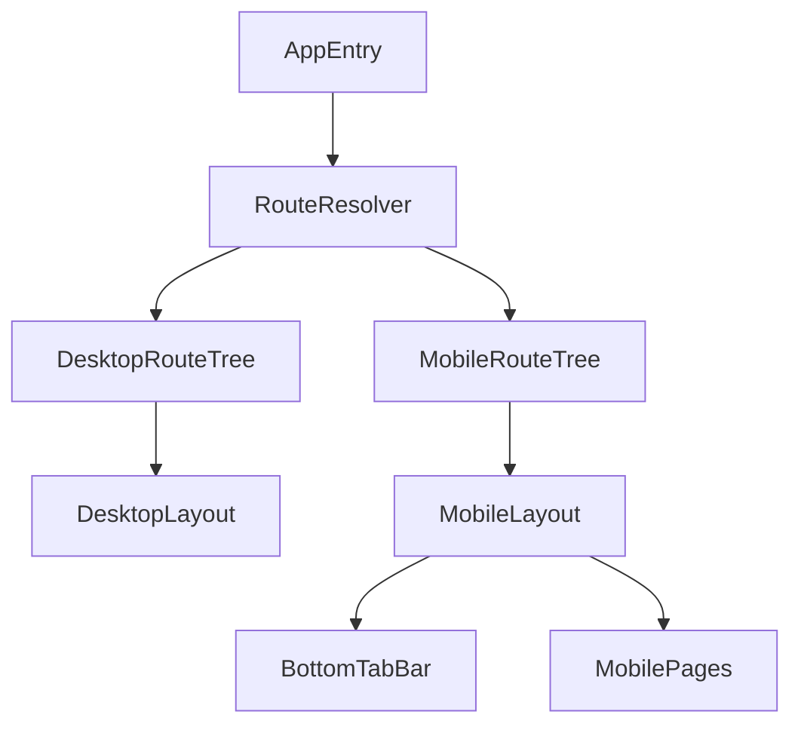

# 手机端架构与路由分层方案

## 1. 背景与目标
在不破坏现有 PC 路由结构的前提下，引入移动端独立页面体系，确保逻辑复用、视图隔离、发布可控。

## 2. 范围
### In Scope
- 在 `novel-splitter-web/src/router/index.tsx` 新增 `/m` 路由组。
- 新增 `MobileLayout` 与 `BottomTabBar`。
- 根路径设备探针与重定向策略。

### Out Scope
- 大规模重写现有 PC 路由。
- 在首期引入 SSR/同构路由。

## 3. 目标架构

## 4. 路由策略
### 4.1 双路由树
- Desktop：保持当前 `/` 为主入口（现有 `Layout` + children）。
- Mobile：新增 `/m` 路由组，子路由建议：
  - `/m/home`
  - `/m/ingest`
  - `/m/knowledge`
  - `/m/chat`

### 4.2 重定向策略
- 当访问 `/` 且命中移动端判定条件时，重定向到 `/m/home`。
- 判定优先级：`matchMedia` 优先，UA 作为补充。
- 必须提供“切换到桌面版”显式入口，避免平板误判。

### 4.3 滚动容器规范
- `MobileLayout` 主容器使用 `overflow-y-auto`。
- 底部导航上方留出安全区：`padding-bottom: env(safe-area-inset-bottom)`。

## 5. 文件级改造建议
- 路由：`novel-splitter-web/src/router/index.tsx`
- 布局：`novel-splitter-web/src/components/Layout.tsx`（保留），新增移动布局文件。
- 页面目录：新增 `novel-splitter-web/src/pages/mobile/` 作为移动页面集合。

## 6. 替代方案与结论
- 替代方案：仅靠 CSS 媒体查询在同一页面隐藏/显示。
- 不采用原因：DOM 冗余、交互冲突、维护成本高、性能风险高。
- 结论：采用独立路由树 + 共享业务逻辑。

## 7. 执行任务拆解
- FE-ARC-01：创建 `/m` 路由树及重定向守卫。
- FE-ARC-02：实现 `MobileLayout` 与 `BottomTabBar`。
- FE-ARC-03：定义移动页面统一容器规范（安全区、滚动、标题栏）。
- QA-ARC-01：验证重定向与返回栈行为。

## 8. 验收标准（DoD）
- `/m/*` 路由可独立运行，且不影响 Desktop。
- 根路径在手机设备能稳定导向 `/m/home`。
- 移动端页面不存在底部导航遮挡内容的问题。

## 9. 风险与待确认
- 深链访问（如外部直接打开 `/m/chat`）需确认鉴权与默认数据回填策略。
- 若未来有小程序/原生端，路由抽象需考虑跨端导航协议。
