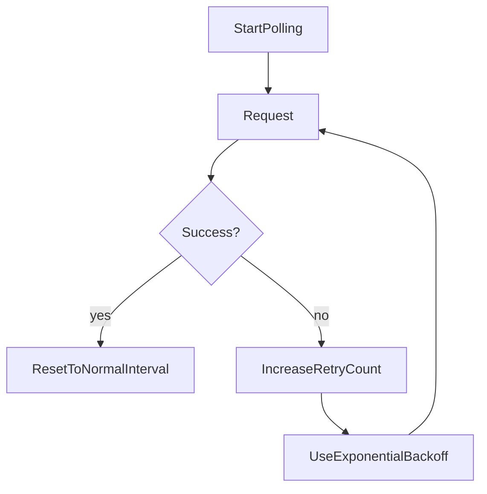

# 移动端网络与轮询策略

## 1. 背景与目标
移动网络环境波动显著，任务轮询、页面切换、前后台切换会导致高失败率与高电量消耗。该文档定义统一网络与轮询策略。

## 2. 范围
### In Scope
- React Query 移动端默认参数。
- 任务轮询退避策略与后台暂停策略。
- 错误提示分级与恢复机制。

### Out Scope
- 服务端推送（WebSocket/SSE）改造。
- 全离线能力（仅保留弱网容错）。

## 3. Query 策略基线
- `retry: 3`
- `retryDelay: exponentialBackoff(max=30s)`
- `staleTime: 10s`（可按页面调整）
- `refetchOnWindowFocus: true`
- `refetchOnReconnect: true`

## 4. 轮询策略
### 4.1 前台轮询
- 任务运行中：每 `2~3s` 轮询一次。
- 空闲态：停止轮询或降为 `30s`。

### 4.2 后台行为
- `document.visibilityState === 'hidden'` 时暂停轮询。
- 回到前台后立即触发一次补偿刷新。

### 4.3 退避规则

## 5. 错误分级
- **可重试错误**：网络抖动、超时、429/5xx，提示“自动重试中”。
- **需用户介入错误**：参数错误、文件不合法，提示明确修复建议。
- **终态错误**：任务失败，提示失败步骤与原因，并提供“重试”入口。

## 6. 状态恢复
- 本地缓存最近活跃 `taskId` 列表。
- App 重启后基于 `novelId` 或 `taskIds` 批量恢复任务状态。
- 恢复失败时降级到“最近任务列表”模式。

## 7. 执行任务拆解
- FE-NET-01：建立移动端 QueryClient 参数集。
- FE-NET-02：在轮询 hook 中加入前后台暂停逻辑。
- FE-NET-03：统一错误分级文案与重试动作。
- QA-NET-01：弱网场景（丢包/高延迟/断网）专项验证。

## 8. 验收标准（DoD）
- 后台停留 5 分钟后前台恢复，状态可在 3 秒内刷新。
- 网络抖动下不出现请求风暴或无限重试。
- 用户可以区分“系统自动重试”与“需要手动处理”两类错误。

## 9. 风险与待确认
- 浏览器后台节流策略差异较大，iOS Safari 需单独回归。
- 若后端轮询接口限流严格，需进一步收紧并发与轮询频次。
