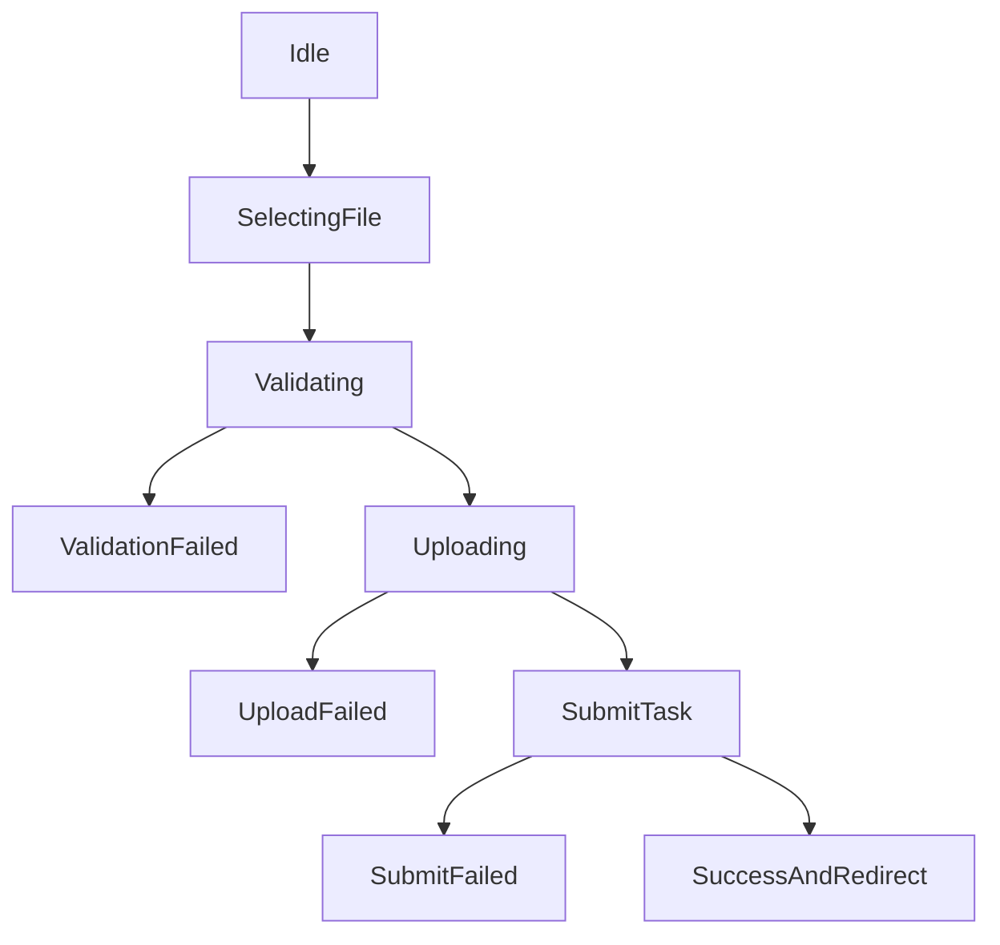

# 页面PRD：任务中心与入库页（移动端）

## 1. 背景与目标
本文件定义移动端 `Home` 与 `Ingest` 两个核心生产入口的页面细则，作为 UI、开发与测试共同依据。

## 2. 范围
### In Scope
- 任务中心（进行中任务、近期完成、失败重试）。
- 入库页（UploadStepper 全流程）。

### Out Scope
- 后台系统管理能力。
- 深度历史筛选与多维统计报表。

## 3. Home 页面
### 3.1 信息层级
1. 顶部状态区：运行中任务数量、总体健康提示。  
2. 进行中任务区：任务卡片（状态、进度、阶段文案）。  
3. 最近完成区：最近 3~5 本小说快捷入口。  
4. 失败任务区：失败原因摘要 + 一键重试。  

### 3.2 关键交互
- 下拉刷新：强制拉取最新任务状态。
- 任务卡点击：进入任务详情或对应小说详情。
- 重试按钮：创建新任务并提示“已重新提交”。

### 3.3 空态与异常态
- 无任务：显示“去上传一本小说”CTA。
- 轮询失败：显示弱网提示，不阻塞浏览历史结果。

## 4. Ingest 页面
### 4.1 步骤设计
- Step1 选择文件
- Step2 校验与书名确认
- Step3 上传中
- Step4 提交处理完成（进入任务中心）

### 4.2 关键字段
- 文件名（必填，自动提取可编辑）
- 文件大小（只读，展示用于信任建立）
- 处理策略（MVP 默认值，隐藏高级参数）

### 4.3 异常处理
- 校验失败不进入上传阶段。
- 上传失败可停留当前步骤重试。
- 提交处理失败保留上下文，支持重提。

## 5. 页面状态机

## 6. 埋点建议
- `mobile_home_view`
- `mobile_ingest_file_selected`
- `mobile_ingest_upload_start`
- `mobile_ingest_upload_success`
- `mobile_ingest_submit_task_success`
- `mobile_task_retry_click`

## 7. 执行任务拆解
- FE-PRD-HI-01：落地 Home 页面卡片结构与数据绑定。
- FE-PRD-HI-02：实现 UploadStepper 状态机。
- FE-PRD-HI-03：接入埋点与错误提示。
- QA-PRD-HI-01：Home/Ingest 主链路回归测试。

## 8. 验收标准（DoD）
- 任务中心首屏可见“进行中任务 + 失败重试入口”。
- 入库流程从选文件到任务提交可稳定完成。
- 异常场景均可恢复，无死链或无反馈状态。

## 9. 风险与待确认
- 重试是否复用旧参数需要产品规则明确。
- 是否默认自动触发 embed 需要与后端流程统一。
