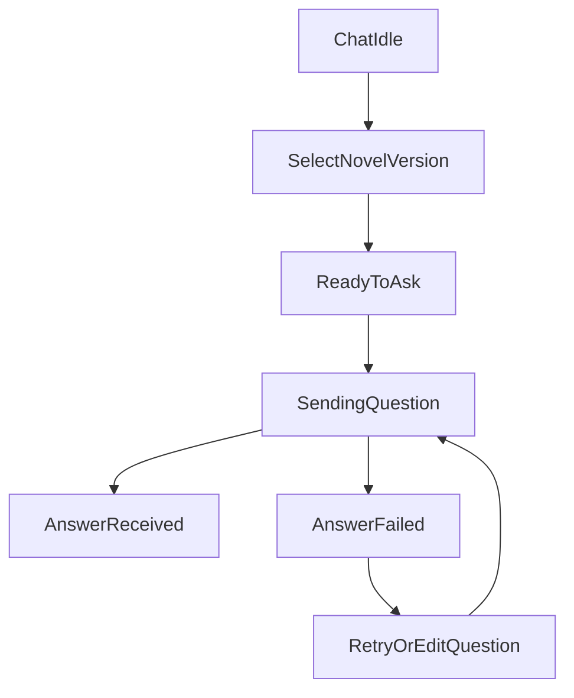

# 页面PRD：知识库与问答页（移动端）

## 1. 背景与目标
知识库与问答是移动端高频消费场景。目标是在小屏环境下保持检索、选择、提问链路简洁可达。

## 2. 范围
### In Scope
- 知识库卡片流、详情浅层预览、删除操作。
- 问答页面沉浸式会话与 Bottom Sheet 资源切换。

### Out Scope
- 深度文本编辑。
- 高级检索参数完全暴露（如复杂过滤器）。

## 3. Knowledge 页面
### 3.1 列表结构
- 卡片字段：书名、版本标签、切片数、更新时间。
- 交互：点击进入详情、侧滑显示删除。
- 分页：无限滚动 + 下拉刷新。

### 3.2 详情结构
- 顶部：小说名、版本、状态标签。
- 内容：章节树浅层展开与片段预览。
- 操作：返回、删除版本（确认弹层）。

### 3.3 异常处理
- 列表为空：引导去入库页面上传。
- 加载失败：支持重试并保留滚动位置。

## 4. Chat 页面
### 4.1 结构
- 顶部栏：当前小说/版本，点击打开 Bottom Sheet。
- 中部：消息流（用户/助手）。
- 底部：输入框、发送按钮、安全区适配。

### 4.2 Bottom Sheet 内容
- 小说列表（最近优先）。
- 版本选择。
- 可选参数（如 TopK）做折叠展示。

### 4.3 关键交互
- 未选择小说时禁用发送并提示选择资源。
- 发送中禁止重复提交。
- 滚动到底部自动吸附最新消息。

## 5. 页面状态机

## 6. 执行任务拆解
- FE-PRD-KC-01：知识库卡片流与详情浅预览。
- FE-PRD-KC-02：实现卡片侧滑删除交互。
- FE-PRD-KC-03：问答页 Bottom Sheet 资源切换。
- FE-PRD-KC-04：消息流状态与滚动体验优化。

## 7. 验收标准（DoD）
- 用户可在 2 步内完成“选择小说版本 -> 发起提问”。
- 知识库列表操作可在单手场景下完成。
- 问答页面在弱网场景下有明确加载与失败反馈。

## 8. 风险与待确认
- 长消息渲染性能需在中低端机型验证。
- 删除操作需明确软删除与硬删除的前端提示文案。
