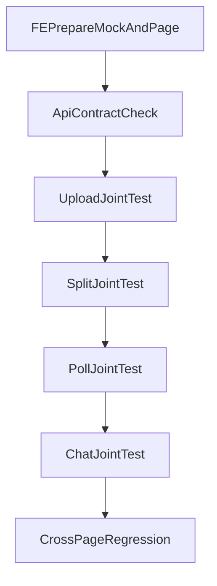

# API 契约与联调执行清单（移动端）

## 1. 背景与目标
移动端项目成败关键在于接口契约稳定与状态语义一致。本文件定义联调矩阵、字段要求、异常协议和联调流程。

## 2. 范围
### In Scope
- 上传、切分、向量化、任务轮询、问答、知识库查询相关接口。
- 契约字段、状态映射、错误码与文案映射。
- 联调用例与验收责任。

### Out Scope
- 新增后端业务能力定义。
- 管理端接口完整联调。

## 3. 接口分组与用途
- **入库链路**
  - `POST /api/novels/upload`
  - `POST /api/novels/{novelId}/split`
  - `POST /api/novels/{novelId}/embed`（可选）
- **任务链路**
  - `GET /api/tasks/poll`
  - `GET /api/tasks/{taskId}`
  - `GET /api/tasks/{taskId}/events`
- **内容链路**
  - `GET /api/novels/{novelId}/chapters`
  - `GET /api/novels/{novelId}/chapters/{chapterId}/scenes`
  - `GET /api/knowledge/...`
- **问答链路**
  - `POST /api/chat`

## 4. 关键字段约定
- 上传响应：`novelId` 必须稳定返回。
- 任务响应：`taskId` 必须可追踪。
- 轮询响应：`status`、`progress`、`message`、`updatedAt` 必须完整。
- 错误响应：必须包含可展示 `message`。

## 5. 状态映射规则
- 后端任务状态 -> 前端展示状态
  - `PENDING` -> `排队中`
  - `PROCESSING` -> `处理中`
  - `SUCCESS` -> `完成`
  - `FAILED` -> `失败`

## 6. 联调流程

## 7. 联调用例清单（核心）
- UC-01：上传成功 -> 返回 `novelId` -> 触发切分 -> 轮询至成功。
- UC-02：上传失败（格式不支持）-> 前端正确提示。
- UC-03：任务失败 -> 首页展示失败原因 -> 一键重试成功。
- UC-04：切换小说版本问答 -> 引用源与版本一致。

## 8. 执行任务拆解
- FE-API-01：建立移动端 API 契约检查清单。
- FE-API-02：完善错误文案映射与兜底逻辑。
- BE-API-01：确认返回字段与状态稳定性。
- QA-API-01：按 UC-01~UC-04 执行联调回归。

## 9. 验收标准（DoD）
- 关键接口字段完整率 100%（按约定）。
- 主链路联调一次通过率 >= 95%。
- 失败场景可定位到具体步骤与原因。

## 10. 风险与待确认
- `/api/novels/{novelId}/pipeline` 是否存在需最终确认，避免移动端误用未实现接口。
- `epub` 支持能力需以真实后端解析能力为准，不可仅前端放开限制。
