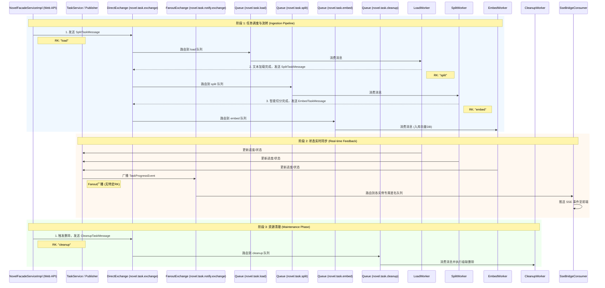

# Novel Splitter 消息队列架构说明文档

## 1. 概述
在 Novel Splitter (小说切分与 RAG 预处理系统) 中，消息队列（RabbitMQ）承担了整个异步流水线的“大动脉”角色。它不仅解耦了耗时的文本处理逻辑，还确保了在大文件处理过程中的系统稳定性。

本文档详细描述了消息队列在系统各个阶段的责任、消息流向序列图、消息契约标准（JSON Schema）以及死信队列（DLQ）的架构规划。

---

## 2. 消息流向序列图 (Sequence Diagram)

系统采用典型的 **事件驱动架构 (EDA)**，通过消息触发核心 Worker 的串行协作。以下序列图展示了核心任务在不同阶段的消息流向：



---

## 3. 系统流程串联说明

### 3.1 阶段 1：任务调度与流转 (Ingestion Pipeline)
解耦耗时操作，实现背压控制。
*   **加载任务 (Load Phase)**：`LoadWorker` 消费 `novel.task.load` 队列，负责将 TXT 文件加载到内存并初步清洗。完成后发送消息到 `split` 路由键。
*   **智能切分 (Split Phase)**：`SplitWorker` 消费 `novel.task.split` 队列，执行章节识别和 Scene 组装。完成后发送消息到 `embed` 路由键。
*   **向量化入库 (Embed Phase)**：`EmbedWorker` 消费 `novel.task.embed` 队列，调用 Embedding 模型并将向量批量写入 ChromaDB。

### 3.2 阶段 2：状态实时同步 (Real-time Feedback)
提供可观测性。
*   各个 Worker 在处理过程中，通过 `TaskService` 发送进度更新。
*   消息发布到 `novel.task.notify.exchange` (Fanout)，广播给所有连接的 `SseBridgeConsumer`，最终推送到前端 UI。

### 3.3 阶段 3：资源清理 (Maintenance Phase)
保证最终一致性。
*   用户删除小说或版本时，系统发送消息到 `cleanup` 路由键。
*   `CleanupWorker` 消费 `novel.task.cleanup` 队列，异步执行物理文件和向量索引的级联删除。

---

## 4. 消息契约文档 (Message Contract Spec)

以下是核心消息体的数据契约标准（JSON Schema 格式），作为团队开发的接口标准。

### 4.1 SplitTaskMessage
**用途**: 触发文本加载和智能切分（复用于 Load 和 Split 阶段）。
```json
{
  "$schema": "http://json-schema.org/draft-07/schema#",
  "title": "SplitTaskMessage",
  "description": "用于触发文本加载和智能切分的消息契约",
  "type": "object",
  "required": ["taskId", "novelId", "version"],
  "properties": {
    "taskId": { "type": "string", "description": "系统全局唯一的任务ID" },
    "novelId": { "type": "string", "description": "关联的小说业务ID" },
    "version": { "type": "string", "description": "数据版本号，用于隔离不同切分策略的数据" },
    "maxScenes": { "type": "integer", "description": "切分上限，可选，用于限制最大处理量", "minimum": 1 }
  }
}
```

### 4.2 EmbedTaskMessage
**用途**: 触发向量化及向量数据库入库。
```json
{
  "$schema": "http://json-schema.org/draft-07/schema#",
  "title": "EmbedTaskMessage",
  "description": "用于触发向量化及向量数据库入库的消息契约",
  "type": "object",
  "required": ["taskId", "novelId", "version"],
  "properties": {
    "taskId": { "type": "string", "description": "系统全局唯一的任务ID" },
    "novelId": { "type": "string", "description": "关联的小说业务ID" },
    "version": { "type": "string", "description": "数据版本号" }
  }
}
```

### 4.3 TaskProgressEvent
**用途**: 前端 SSE 推送的实时状态广播事件。
```json
{
  "$schema": "http://json-schema.org/draft-07/schema#",
  "title": "TaskProgressEvent",
  "description": "用于前端 SSE 推送的实时状态广播事件",
  "type": "object",
  "required": ["taskId", "status", "timestamp"],
  "properties": {
    "taskId": { "type": "string", "description": "任务ID" },
    "progress": { "type": "integer", "description": "处理进度百分比 (0-100)", "minimum": 0, "maximum": 100 },
    "message": { "type": "string", "description": "进度相关的易读文本，如 '正在向量化 40/100'" },
    "status": { 
      "type": "string", 
      "enum": ["PENDING", "PROCESSING", "SUCCESS", "FAILED"],
      "description": "任务当前状态枚举" 
    },
    "timestamp": { "type": "integer", "description": "事件发生的毫秒级时间戳" }
  }
}
```

### 4.4 CleanupTaskMessage
**用途**: 触发异步垃圾数据清理。
```json
{
  "$schema": "http://json-schema.org/draft-07/schema#",
  "title": "CleanupTaskMessage",
  "description": "用于触发异步垃圾数据清理的消息契约",
  "type": "object",
  "required": ["cleanupTaskId", "targetId", "targetType"],
  "properties": {
    "cleanupTaskId": { "type": "integer", "description": "清理任务自身的数据库自增ID" },
    "targetId": { "type": "string", "description": "需要被清理的目标标识(通常为小说ID)" },
    "targetType": { 
      "type": "string", 
      "enum": ["NOVEL", "VERSION"], 
      "description": "清理范围：NOVEL=清理整个小说，VERSION=仅清理某一个版本" 
    },
    "version": { "type": "string", "description": "当 targetType 为 VERSION 时必填" }
  }
}
```

---

## 5. 死信队列 (DLQ) 架构规划

**当前状态**：当前系统未配置死信队列 (DLQ)。若消息多次重试失败后会被直接丢弃，存在数据丢失隐患。

**规划方案 (待实施)**：
为确保系统的健壮性，需要在 `RabbitConfig.java` 中为所有核心工作队列引入 DLQ 架构，以便在消息多次重试失败后能被捕获和人工干预。

1.  **声明 DLQ 交换机和队列**：
    ```java
    @Bean
    public DirectExchange dlqExchange() {
        return new DirectExchange("novel.task.dlq.exchange");
    }

    @Bean
    public Queue dlqQueue() {
        return new Queue("novel.task.dlq", true);
    }
    
    @Bean
    public Binding dlqBinding() {
        return BindingBuilder.bind(dlqQueue()).to(dlqExchange()).with("dlq.routing.key");
    }
    ```

2.  **重构业务队列声明**：为现有的 `load`、`split`、`embed`、`cleanup` 队列添加 DLQ 属性。
    ```java
    @Bean
    public Queue loadTaskQueue() {
        return QueueBuilder.durable(LOAD_TASK_QUEUE)
                .withArgument("x-dead-letter-exchange", "novel.task.dlq.exchange")
                .withArgument("x-dead-letter-routing-key", "dlq.routing.key")
                .build();
    }
    // 其他队列同理配置...
    ```

3.  **DLQ 监控与干预**：
    *   增加一个专门的 `DlqWorker` 监听 `novel.task.dlq` 队列。
    *   将失败消息记录到数据库的异常告警表中，并触发告警（如邮件/企业微信）。
    *   提供管理后台接口，允许管理员查看失败原因并手动重新投递消息（Republish）。